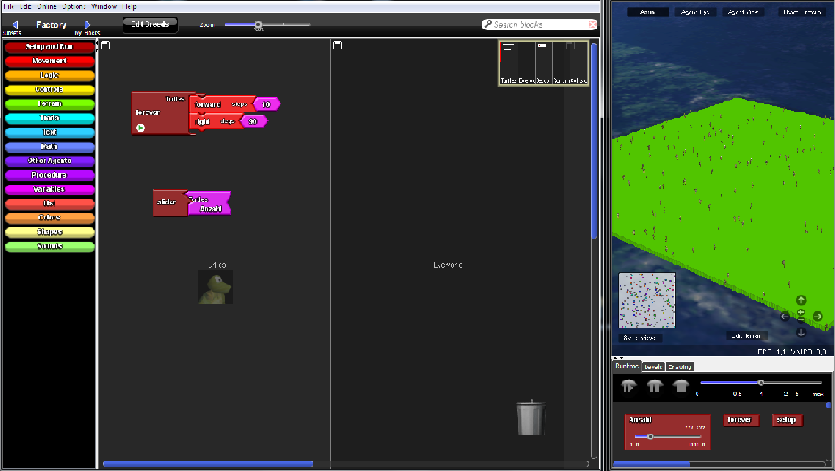
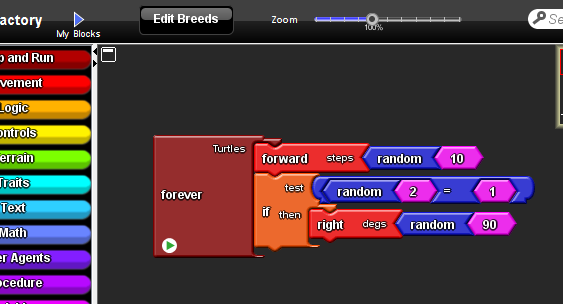

# Projekt StarlogoTNG - Turtles

# Stundenblog

[Erste Informatikstunde](#eins)

[Zweite Informatikstunde](#zwei)

[Dritte Informatikstunde](#drei)

# Erste Informatikstunde

Nachdem wir uns für das Programmieren einer 3D Welt mit StarLogo TNG entschieden haben, haben wir uns in der ersten Stunde mit dem Programm vertraut gemacht. Wir haben gelernt Agenten zu erstellen, ihre Anzahl zu verstellen und wie man sie in der 3D Welt steuern kann. 

 
 
 
 
 
 
 # Zweite Informatikstunde
 
In dieser Informatikstunde haben wir uns hauptsächlich mit unserer README Datei beschäftigt. Wir wollten einen Screenshot in unsere Datei einfügen und haben uns dazu eine Anleitung auf YouTube angesehen. Leider hat es trotzdem nicht funktioniert. Nach langem Herumprobieren und mit etwas Hilfe von Herrn Buhl haben wir es endlich eine Möglichkeit gefunden einen Screenshot in unseren Stundenblog einzufügen. Doch seltsamerweise wurde unser Screenshot immer noch nicht als Bild angezeigt. Unser Fehler war, dass wir ein falsches Lehrzeichen eingefügt hatten. Dies hat uns direkt am Anfang gezeigt, dass selbst die kleinsten Details ausschlaggebend für das Endergebnis sind und uns gelehrt beim nächsten Mal genauer auf Kleinigkeiten zu achten. Außerdem haben wir herausgefunden wie man Verzeichnis mit den dazugehörigen Texten verlinkt. Am Ende dieser Stunde waren wir sehr glücklich über unsere Leistung. :)
 
 
 # Dritte Informatikstunde
 
 Heute haben wir herausgefunden wie man "random" Blöcke benutzt. Sodass die Agenten sich willkürlich im Spaceland bewegen. 
 
 
 
 
 
 
 
