# Projekt StarlogoTNG - Turtles

## Stundenblog

[Erste Informatikstunde](#eins)

[Zweite Informatikstunde](#zwei)

[Dritte Informatikstunde](#drei)

[Vierte Informatikstunde](#vier)

[Fünfte Informatikstunde](#fünf)

[Sechste Informatikstunde](#sechs)

[Siebte Informatikstunde](#sieben)

[Achte Informatikstunde](#acht)

[Neunte Informatikstunde](#neun)

[Zehnte Informatikstunde](#zehn)

[Elfte Informatikstunde](#elf)

[Zwölfte Informatikstunde](#zwölf)

## Erste Informatikstunde

In unserer ersten Informatikstunde haben wir uns alle einen Github Account angelegt, in dem wir unsere Ergebnisse der Stunden festhalten. Da wir beide keinerlei Vorkenntnisse im Programmieren hatten, haben wir uns für das Programmieren einer 3D Welt mit dem  Programm Starlogo TNG entschieden, da Herr Buhl meinte es sei auch für Anfänger geeignet. Heute haben wir außerdem angefangen uns mit dem Programm vertraut zu machen. Wir haben gelernt Agenten zu erstellen, ihre Anzahl zu verändern und wie man sie in der 3D Welt mit Hilfe von bestimmten Blöcken steuern kann. 

 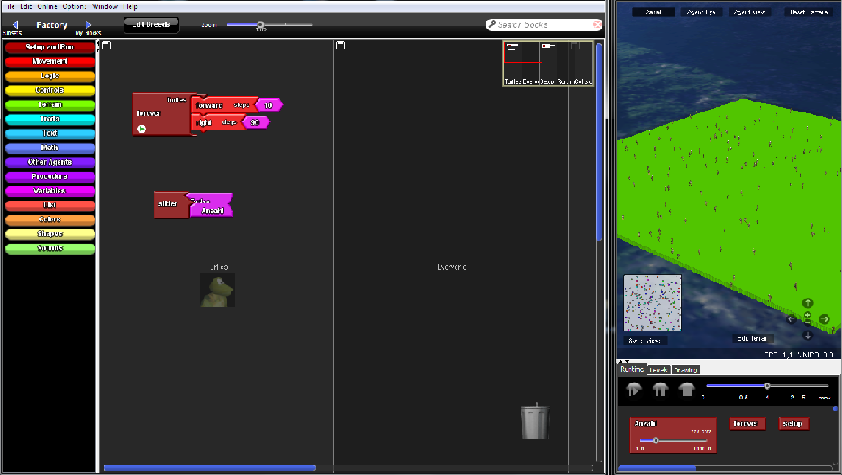
 
 
 ## Zweite Informatikstunde
 
In dieser Informatikstunde haben wir uns hauptsächlich mit unserer README Datei beschäftigt. Wir wollten einen Screenshot in unsere Datei einfügen und haben uns dazu eine Anleitung auf YouTube angesehen. Leider hat es trotzdem nicht funktioniert. Nach langem Herumprobieren und mit etwas Hilfe von Herrn Buhl haben wir endlich eine Möglichkeit gefunden einen Screenshot in unseren Stundenblog einzufügen. Doch seltsamerweise wurde unser Screenshot immer noch nicht als Bild angezeigt. Unser Fehler war, dass wir ein falsches Lehrzeichen eingefügt hatten. Dies hat uns direkt am Anfang gezeigt, dass selbst die kleinsten Details ausschlaggebend für das Endergebnis sind und uns gelehrt beim nächsten Mal genauer auf Kleinigkeiten zu achten. Außerdem haben wir herausgefunden wie man ein Verzeichnis mit den dazugehörigen Texten verlinkt. Am Ende dieser Stunde waren wir sehr glücklich über unsere Leistung. :)
 
 
 ## Dritte Informatikstunde
 
Heute haben wir herausgefunden wie man mit "if-Blöcken" und "random-Blöcken" arbeitet. Unser Ziel war es, dass die Agenten sich willkürlich im Spaceland bewegen. Dazu stellt man mit Hilfe eines "if-Blocks" eine Bedingung. Wenn diese eintritt, wird das vorher festgelegte Ereignis ausgeführt. In unserem Fall haben wir in die Gleichung für die Bedingung einen "random-Block" eingefügt, damit das Ereignis auch wirklich willkürlich eintritt. "random-Blöcke" wählen aus einem festgelegten Zahlenbereich, in unserm Fall eins bis zwei, zufällig eine Zahl aus. Erfüllt diese Zahl die Gleichung, tritt das Ereignis ein, in unserm Fall dreht sich der Agent um eine zufällige Gradzahl zwischen eins und 90. 
 
 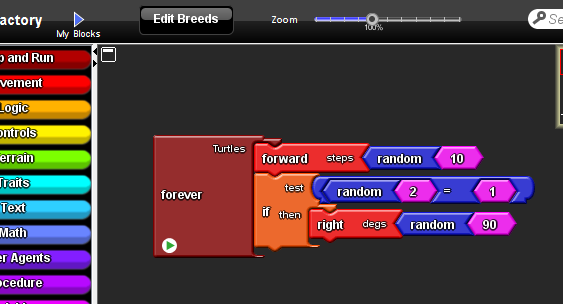
 
 
 ## Vierte Informatikstunde
 
In dieser Stunde haben wir gelernt wie Agenten miteinander kommunizieren. Dafür haben wir Kollisionsblöcke benutzt. In diese setzt man den Befehl "say" ein und danach den Text, welchen die Agenten sagen sollen. Wenn jetzt zwei Agenten aufeinander treffen sagen sie sich "Hallo". Diesen Text kann man beliebig ändern.

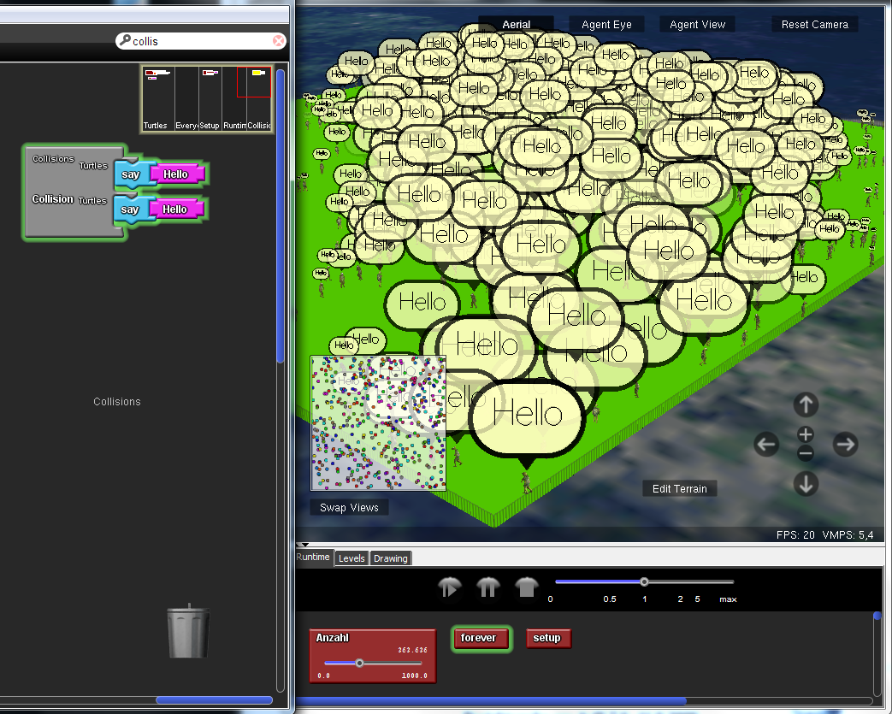

Außerdem haben wir angefangen den Agenten verschiedene Farben zu geben. Unser Ziel war es die Farben genau auf die Agenten aufzuteilen. Also ein Drittel der Agenten sollte rot, ein Drittel blau und ein Drittel grün sein. Um dies zu erreichen mussten wir wieder "if-Blöcke" verwenden. In diese haben wir "Gleichungs-Blöcke" eingesetzt, die bestimmen unter welcher Bedingung die Agenten eine bestimmte Farbe annehmmen. Die Schildkröten (unsere Agenten) selber haben allerdings die Farbe nicht gewechselt, sondern nur die Punkte, die ihre Position im Spaceland anzeigen. Dieses Problem wollen wir in der nächsten Stunde lösen.

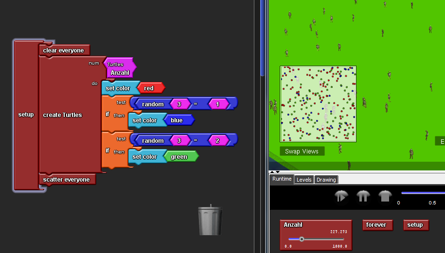

## Fünfte Informatikstunde

Unsere Aufgabe für diese Stunde war, die Agenten so zu programmieren, dass sie während einer Kollision die Farbe wechseln. Zusätzlich haben wir den Befehl "say: hi" eingefügt, damit wir besser erkennen konnten, wenn zwei Agenten kollidieren. Da nur die Positionspunkte die Farbe anzeigen, was wir in der letzten Stunde schon als Problem identifiziert hatten, und wir deshalb nicht gut erkennen konnten, ob die Schildkröten wirklich die Farbe ändern, haben wir einen anderen Agenten ausgewählt. 
Damit der Agent farbig erscheint, darf er keine Musterung (Haut, Augen etc.) besitzen. Wir haben uns schließlich für einen weißen Bären entschieden. Nachdem die Agenten ihre Farbe angenommen hatten, haben wir die Perspektive in "Agent-View" gewechselt, um nun besser den Farbwechsel bei einer Kollision verfolgen zu können.

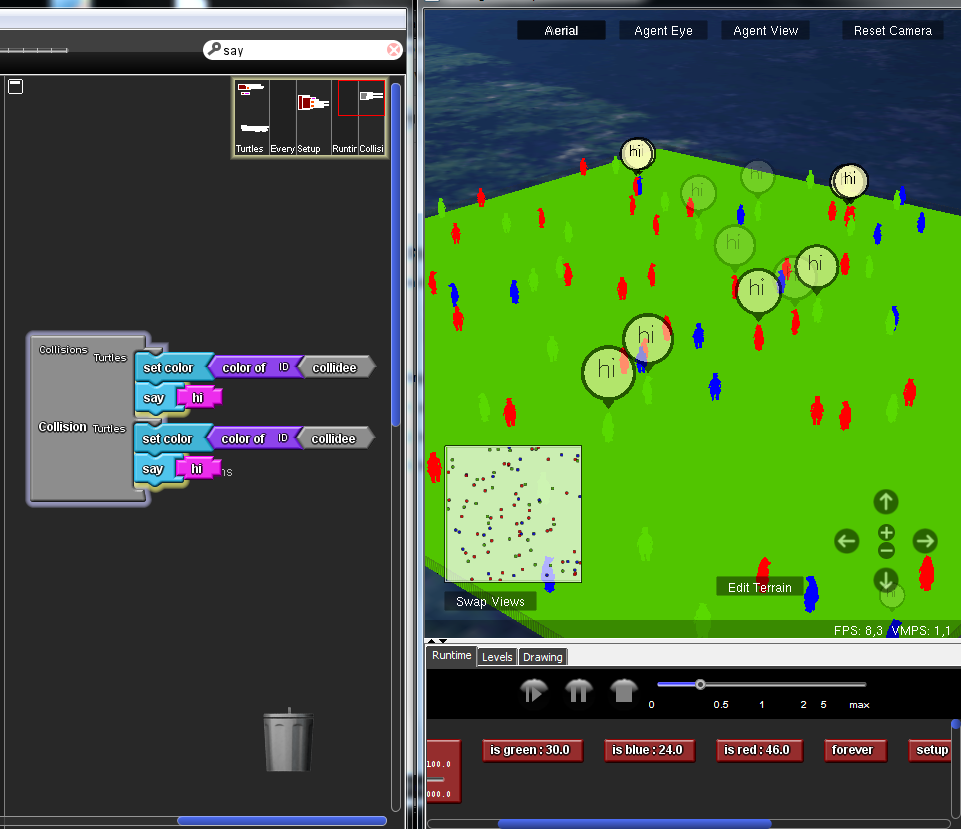

Außerdem mussten wir in der heutigen Stunde leider feststellen, dass unsere Überlegung aus der vierten Stunde falsch waren. Wir dachten, dass wir mit den "if-Blöcken" unsere gesamte Anzahl der Agenten dritteln könnten, indem wir zwei Bedingungen stellen. Generell sollten alle Agenten rot sein, wenn allerding eine zufällige Zahl aus drei gleich 1 ist sollten sie blau werden, bei einer zufälligen Zahl gleich zwei grün. 

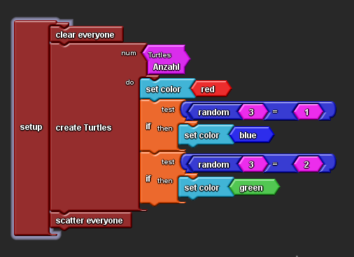

Damit wurde ein drittel der gesamten Agenten blau, und ein drittel der gesamten Agenten grün. Das bedeutet, dass auch blaue Agenten grün wurden und wir keine genaue Aufteilung der drei Farben erreicht haben, was eigentlich unser Ziel gewesen ist. Wie viele Agenten welcher Farbe angehören konnten wir mit bestimmten "count-Blöcken" zählen.

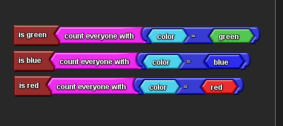

Durch das Einfügen dieser Blöcke, wurde uns die genaue Anzahl der Agenten in dem Space-Land-Fenster angezeigt.

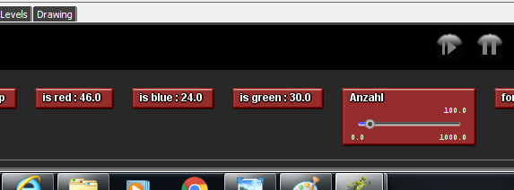

Unser Plan für die nächste Stunde ist, diesen Fehler zu beheben.

## Sechste Informatikstunde
 
Nachdem wir heute weiter an unserem Stundenblog geschrieben haben, widmeten wir uns dem Problem der vorigen Stunde: Die Farben waren nicht gleichmäßig auf die Agenten aufgeteilt. Wir haben die Bedingungen so geändert, dass die Hälfte der roten Agenten blau wurden und ein drittel der gesamten Anzahl, also rote und blaue Agenten zusammen grün. 

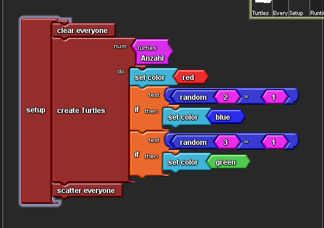

Dadurch kann jetzt eine relativ gleichmäßige Aufteilung gewährleistet werden. Was wir durch die "count-Blöcke" kontrollieren konnten.

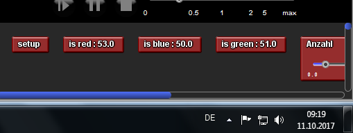

## Siebte Informatikstunde

In der heutigen Informatikstunde bestand unsere Aufgabe darin, eine Bedingung so zu programmieren, dass wenn zwei Agenten mit der selben Farbe kollidieren sterben. Dafür mussten wir in den "Kollisions-Block" einen "Ifelse-Block" einsetzen. In diesen setzten wir dann unsere oben genannte Bedingung (wenn zwei gleichfarbige Agenten kollidieren (test-Lücke), sterben sie (then-Lücke)) ein. Aber weiterhin sollten die Agenten, wenn sie einen anders farbigen treffen, ihre Farbe tauschen. Die Bedingung haben wir in die "else-Lücke" eingesetzt.

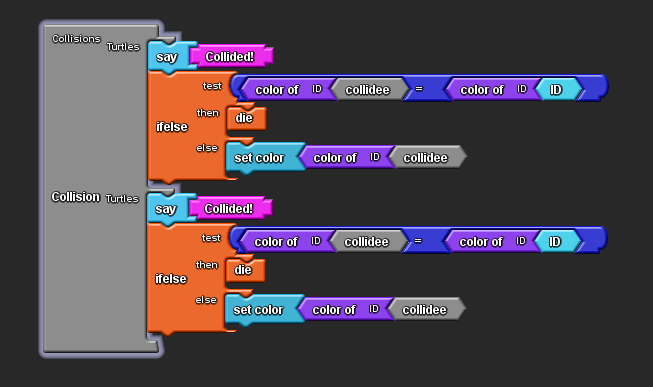

Um die Richtigkeit unserer Programmierung zu überpfüfen, haben wir den Befehl "say:Collided!" eingefügt, einen Agenten in der "Agent-View" verfolgt und den Rückgang der verschiedenen Farben beobachtet. Durch die Sprechblasen, die bei einer Kollision auftraten, wussten wir wo zwei Agenten miteinander kollidierten und mit Hilfe des "Agent-Views" konnten wir diese besser beobachten. Die "count-Blöcke" zeigten uns, dass die Anzahlen der jeweiligen Farben immer um zwei zurückgingen und bestätigten damit unsere Programmierung.

## Achte Informatikstunde

In dieser Informatikstunde haben wir eine neue Welt mit einem anderen Agenten erstellt. In dieser Welt kann man den Agenten nun mit der Tastatur steuern. Mit Hilfe eines "if-Blocks" konnten wir die Bedingung stellen, dass der Agent sich vorwärts bewegt, wenn die obere Pfeiltaste gedrückt wird.

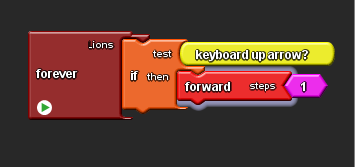

Dies haben wir danach ebenfalls für die Bewegung nach rechts, links und rückwärts programmiert. Wir freuen uns, dass wir den Agenten nun steuern können und er nicht mehr willkürlich im Spaceland herumläuft.

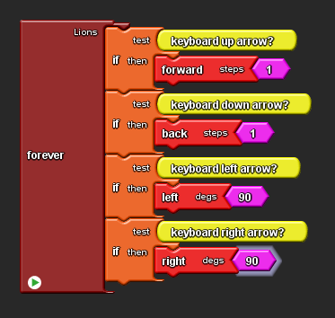

Damit unser Agent nicht nur in dem Spaceland herum laufen kann, haben wir außerdem Blöcke eingefügt, mit denen er später Aktionen ausführen kann, wie zum Beispiel aufsammeln. Dafür mussten wir ein neues "Breed" erstellen, wir haben uns für den Würfel entschieden und dieses "Breed-Block" genannt. Sobald das neue "Breed" erstellt wurde, konnten wir neben Löwen auch Blöcke kreieren. Wir haben erst einmal hundert Blöcke erstellt und sie durch den "scatter everyone-Block" in dem Spaceland verteilt. 

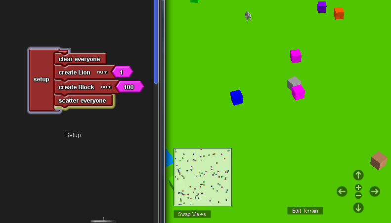

## Neunte Informatikstunde

Heute haben wir mit den Ergebnissen der letzten Stunde weitergearbeitet. Unsere Aufgabe war den Agenten die Blöcke einsammeln zu lassen. Dafür haben wir nach einem passenden Programmierungs-Block gesucht, der die Funtion besitzt Dinge einzusammeln. Nachdem wir feststellen mussten, dass es so einen Block nicht gibt, haben wir uns eine andere Lösung überlegt. Wenn der Agent auf einen Block trifft, mit ihm also kollidiert, "stirbt" der Block und verschwindet. Zur Kontrolle programmierten wir den Agenten so, dass er bei einer Kollision "Hurray" sagt. Außerdem hatten zuvor einen "count everyone-Block" eingefügt, durch den wir die Anzahl aller Blöcke plus den einen Löwen kontrollieren konnten.

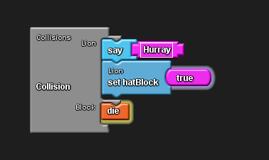

Da wir eigentlich erreichen wollten, dass der Agent den Block einsammelt und nicht, dass der Block einfach verschwindet, benutzten wir "Boolsche Variablen". Diese legt fest, dass der Agent vor einer Kollision keinen Block "besitzt": Die Boolsche Variable "set hatBlock" ist falsch. Wenn er nun aber mit einem Block kollidiert merkt er sich, dass er einen Block "besitzt": Die Boolsche Variable "set hatBLock" ist erfüllt ("true").

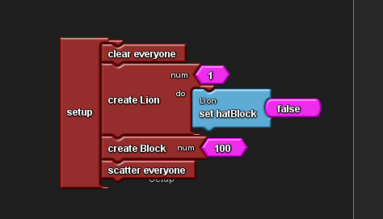 

Diese "Boolsche Variable" taucht auch in dem Agentenfester auf. Somit lässt sich kontrollieren, ob der Agent gerade im Besitz eines Blocks ist oder nicht.

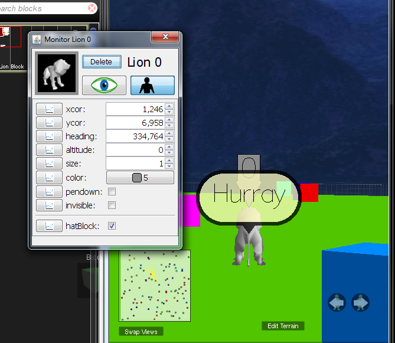

In der heutigen Stunde haben wir es also geschafft zu programmieren, dass der Block bei einer Kollision mit unserem Agenten stirbt und sich der Agent merkt, dass er nun einen Block "besitzt". Für den Spieler wirkt es so als würde der Agent den Block einsammeln. 

## Zehnte Informatikstunde

Unser heutiges Ziel bestand darin den Agenten wieder einen Block abwerfen zu lassen. Am Anfang wussten wir allerdings nicht was wir dafür programmieren mussten. Uns war klar, dass wir einen neuen Block entstehen lassen mussten und haben es zu erst mit "Create-Blöcken" versucht. Schnell wurde uns bewusst, dass es so aber nicht funktionieren kann. Deshalb haben wir Herrn Buhl nach Tipps gefragt. Er hat uns dann gezeigt wie man mit "Hatch-Do-Blöcken" arbeitet. "Hatch-Blöcke" erzeugen eine exakte Kopie des Agenten, da wir aber keinen Löwen, sondern einen Block kreieren wollten, setzten wir in die "Do-Lücke" einen "set Breed-Block" und in diesen einen "Breed:Block-Block" ein. Somit entsteht kein Löwe, sondern ein Block. Damit man in dem Agentenfenster erkennen kann, dass der Löwe jetzt keinen Block mehr besitzt, mussten wir die Boolsche-Variable "sethatBlock" in falsch ändern. Wenn der Löwe also einen Block abgegeben hat, kann man dies in dem Agentenfenster kontrollieren.  Natürlich mussten wir noch eine Bedingung festlegen, unter welcher der Löwe einen Block abgibt. Mit Hilfe eines "if-Blocks" und eines "Logic-Blocks", der zwei Bedingungen mit einem "and" verbindet, stellten wir sicher, dass der Agent nur dann einen Block abgeben kann, wenn er vorher einen Block hatte und die Leertaste ("space bar") gedrückt wird. 

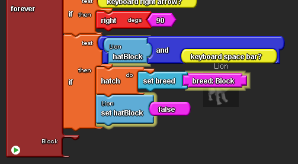

Somit haben wir es schließlich geschafft, dass der Agent einen Block abgeben kann. Darüber haben wir uns sehr gefreut, allerdings ist uns beim Ausprobieren ein Problem aufgefallen. Beim Drücken der Leertaste erscheint zwar für kurze Zeit ein neuer Block, aber er verschwindet danach sofort wieder. Das liegt daran, dass der Agent den Block an der gleichen Stelle, an der er sich selber befindet, abwirft und dadurch sofort wieder mit dem Block kollidiert und der Block dabei stirbt. Dieses Problem konnten wir bis jetzt noch nicht lösen.

## Elfte Informatikstunde

In der letzten Stunde haben wir unser Projekt abgeschlossen, uns aber dafür entschieden auch in den folgenden Stunden mit Starlogo TNG zu arbeiten. Für die nächste Einheit konnten wir selber entscheiden, ob wir ein neues Projekt in einem neuen Programm anfangen oder unser altes Projekt weiterführen. Da wir uns bereits in Starlogo TNG eingearbeitet hatten, wollten wir gerne damit weiterarbeiten und beschlossen ein Adventurespiel zu programmieren.

Dafür erschufen wir in Starlogo TNG eine neue Welt mit einem neuen Agenten. Unser Agent ist nun Mario, der mit Hilfe der Tastatur in einer Welt voller Bäume und Gräser bewegt werden kann. 

Das Ziel unseres Spiel ist, dass Mario eine Art Schlüssel einsammeln muss, damit er in ein Haus hinein gehen kann. Als Schlüssel haben wir eine pinke Orchidee gewählt, die wie die Bäume in dem Spaceland wilkürlich platziert wird ("scatter-everyone-Block"). 

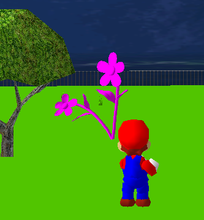 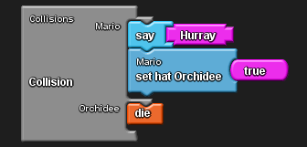 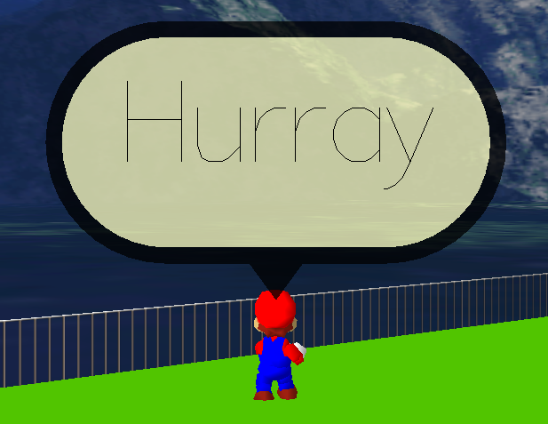

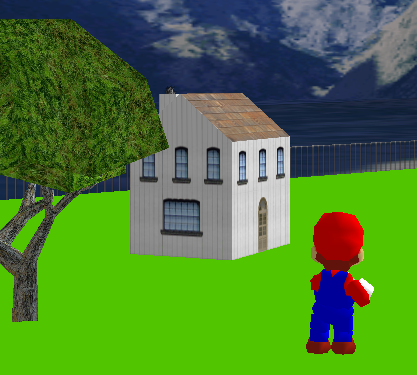

## Zwölfte Informatikstunde

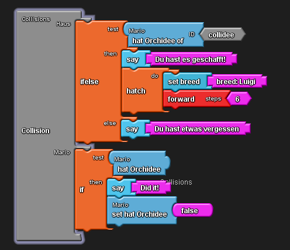

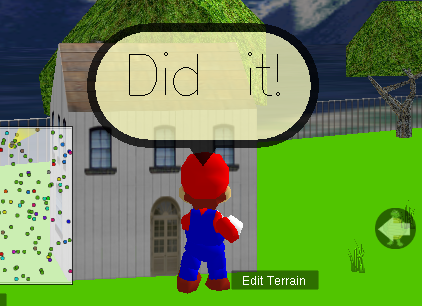
