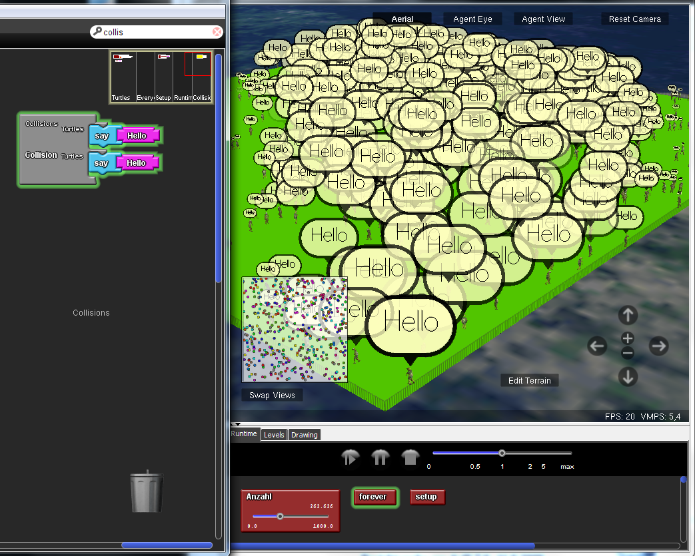
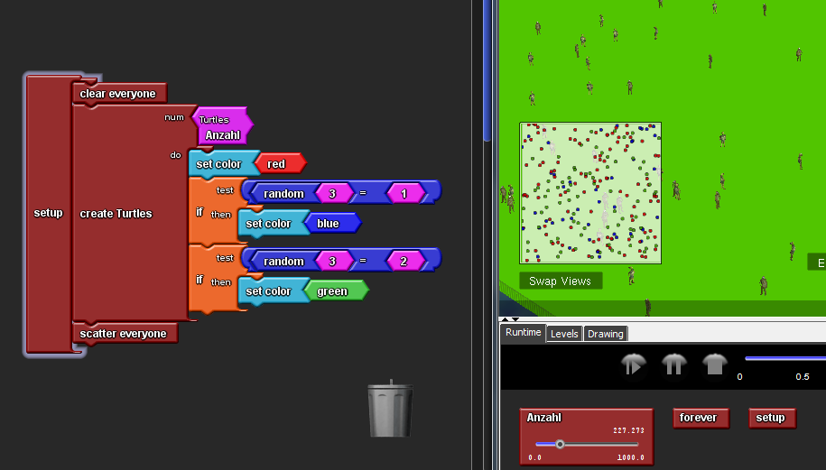
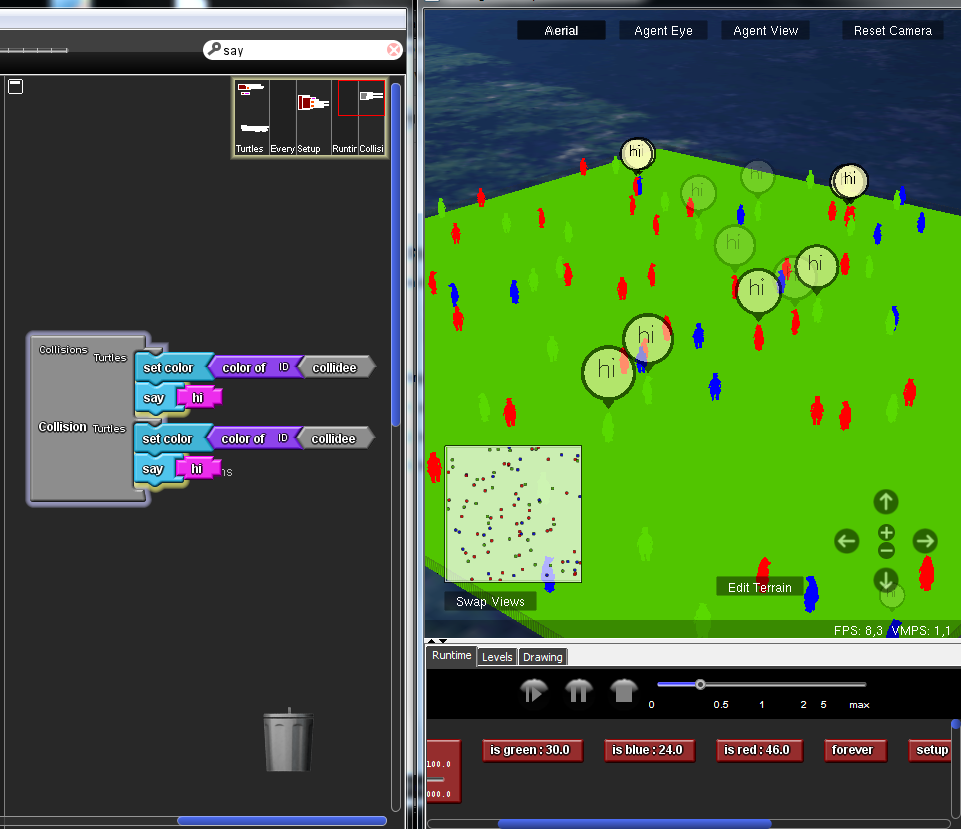
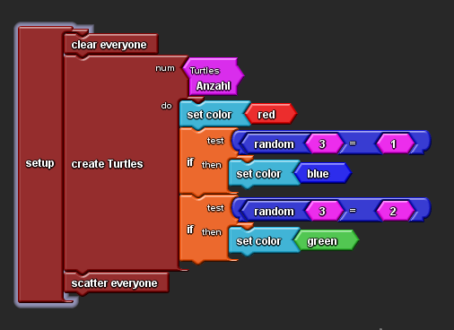
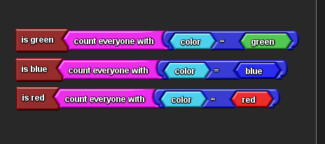
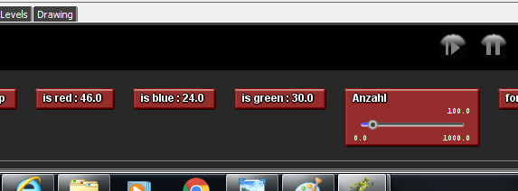
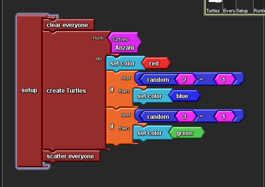

# Projekt StarlogoTNG - Turtles

## Stundenblog

[Erste Informatikstunde](#eins)

[Zweite Informatikstunde](#zwei)

[Dritte Informatikstunde](#drei)

[Vierte Informatikstunde](#vier)

[Fünfte Informatikstunde](#fünf)

[Sechste Informatikstunde](#sechs)

[Siebte Informatikstunde](#sieben)

# Erste Informatikstunde

Nachdem wir uns für das Programmieren einer 3D Welt mit StarLogo TNG entschieden haben, haben wir uns in der ersten Stunde mit dem Programm vertraut gemacht. Wir haben gelernt Agenten zu erstellen, ihre Anzahl zu verstellen und wie man sie in der 3D Welt steuern kann. 

 
 
 
 
 
 
 # Zweite Informatikstunde
 
In dieser Informatikstunde haben wir uns hauptsächlich mit unserer README Datei beschäftigt. Wir wollten einen Screenshot in unsere Datei einfügen und haben uns dazu eine Anleitung auf YouTube angesehen. Leider hat es trotzdem nicht funktioniert. Nach langem Herumprobieren und mit etwas Hilfe von Herrn Buhl haben wir es endlich eine Möglichkeit gefunden einen Screenshot in unseren Stundenblog einzufügen. Doch seltsamerweise wurde unser Screenshot immer noch nicht als Bild angezeigt. Unser Fehler war, dass wir ein falsches Lehrzeichen eingefügt hatten. Dies hat uns direkt am Anfang gezeigt, dass selbst die kleinsten Details ausschlaggebend für das Endergebnis sind und uns gelehrt beim nächsten Mal genauer auf Kleinigkeiten zu achten. Außerdem haben wir herausgefunden wie man Verzeichnis mit den dazugehörigen Texten verlinkt. Am Ende dieser Stunde waren wir sehr glücklich über unsere Leistung. :)
 
 
 # Dritte Informatikstunde
 
 Heute haben wir herausgefunden wie man "random" Blöcke benutzt. Sodass die Agenten sich willkürlich im Spaceland bewegen. 
 
 
 
 
 # Vierte Informatikstunde
 
In dieser Stunde haben wir gelernt wie Agenten miteinander kommunizieren. Dafür haben wir Kollisionsblöcke benutzt. In diese setzt man den Befehl "say" ein und danach den Text, welchen die Agenten sagen sollen. Wenn jetzt zwei Agenten aufeinander treffen sagen sie sich "Hallo". Diesen Text kann man beliebig ändern.

Außerdem haben wir angefangen den Agenten verschiedene Farben zu geben. Unser Ziel war es die Farben genau auf die Agenten aufzuteilen. Also ein Drittel der Agenten sollte rot, ein Drittel blau und ein Drittel grün sein. Um dies zu erreichen mussten wir "if-Blöcke" verwenden. In diese haben wir "Gleichungs-Blöcke" eingesetzt, die bestimmen unter welcher Bedingung die Agenten eine bestimmte Farbe annehmmen. Die Schildkröten (unsere Agenten) selber haben allerdings die Farbe nicht gewechselt, sondern nur die Punkte, die ihre Position im Spaceland anzeigen.

# Fünfte Informatikstunde

Unsere Aufgabe für diese Stunde war, die Agenten so zu programmieren, dass sie während einer Kollision die Farbe wechseln. Zusätzlich haben wir den Befehl "say: hi" eingefügt, damit wir besser erekennen konnten, wenn zwei Agenten kollidieren. Da nur die Positionspunkte die Farbe anzeigen und wir deshalb nicht gut erkennen konnten, ob die Schildkröten wirklich die Farbe ändern, haben wir einen anderen Agenten ausgewählt. 
Damit der Agent farbig erscheint, darf er keine Musterung (Haut, Augen etc.) besitzen. Wir haben uns schließlich für einen weißen Bären entschieden. Nachdem die Agenten ihre Farbe angenommen hatten, haben wir die Perspektive in "Agent-View" gewechselt, um nun besser den Farbwechsel bei einer Kollision verfolgen zu können.

Außerdem mussten wir in der heutigen Stunde leider feststellen, dass unsere Überlegung aus der vierten Stunde falsch waren. Wir dachten, dass wir mit den "if-Blöcken" unsere gesamte Anzahl der Agenten dritteln könnten, indem wir zwei Bedingungen stellen. Generell sollten alle Agenten rot sein, wenn allerding eine zufällige Zahl aus drei gleich 1 ist sollten sie blau werden, bei einer zufälligen Zahl gleich zwei grün. 

Damit wurde ein drittel der gesamten Agenten blau, und ein drittel der gesamten Agenten grün. Das bedeutet, dass auch blaue Agenten grün wurden und wir keine genaue Aufteilung der drei Farben erreicht haben, was eigentlich unser Ziel gewesen ist. Wie viele Agenten welcher Farbe angehören konnten wir mit bestimmten "count-Blöcken" zählen.

Durch das Einfügen dieser Blöcke, wurde uns die genaue Anzahl der Agenten in dem Space-Land-Fenster angezeigt.

Unser Plan für die nächste Stunde ist, diesen Fehler zu beheben.

# Sechste Informatikstunde
 
Nachdem wir heute weiter an unserem Stundenblog geschrieben haben, widmeten wir uns dem Problem der vorigen Stunde: Die Farben waren nicht gleichmäßig auf die Agenten aufgeteilt. Wir haben die Bedingungen so geändert, dass die Hälfte der roten Agenten blau wurden und ein drittel der gesamten Anzahl, also rote und blaue Agenten zusammen grün. 

Dadurch kann jetzt eine relativ gleichmäßige Aufteilung gewährleistet werden. Was wir durch die "count-Blöcke" kontrollieren konnten.

# Siebte Informatikstunde

In der heutigen Informatikstunde bestand unsere Aufgabe darin, eine Bedingung so zu programmieren, dass wenn zwei Agenten mit der selben Farbe kollidieren sterben. Dafür mussten wir in den "Kollisions-Block" einen "Ifelse-Block" einsetzten

